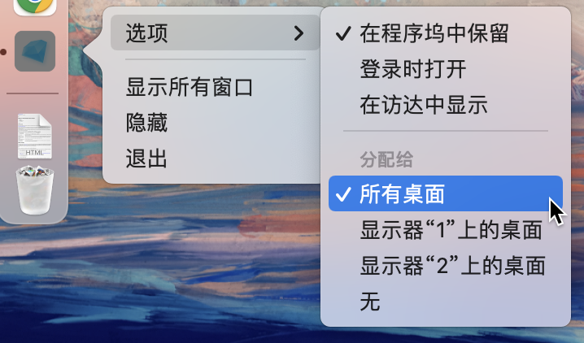

# Skywalker
> 一个Mac OS中的剪贴板文本存储工具，为你在码字的过程中提高效率。
## 项目安装
> Node v14+
```
npm install
```
### 启动开发环境的本地服务
```
npm run dev
```
### 打包为Mac app
```
npm run electron:build
```
### 完成打包
> 出现Build complete字样表示打包成功 如下图:


### 安装App
> 打包完成后，进入项目路径下`/dist_electron`，找到`dist_electron/Skywalker-x.x.x.dmg`安装包，安装即可。
### Tips
> 安装完成后 打开App 在Dock中右键选择分配给"所有桌面" 予以在你的Mac中的每个桌面都可以无缝调起Skywalker面板。 如下图:


### 使用说明
- 你可以尝试多次、在不同的App中复制文本
- 然后通过Cmd+Shift+V调起剪贴板的面板
- 通过快捷键: 向左A或← 向右B或→
- 查找你刚刚复制过的文本
- Enter/Space或点击左下角的Icon获取内容到系统剪贴板
- 恭喜你 已选择的内容已存储到你的剪贴板中
- 遇到问题请与我联系
- tyrusl@163.com

